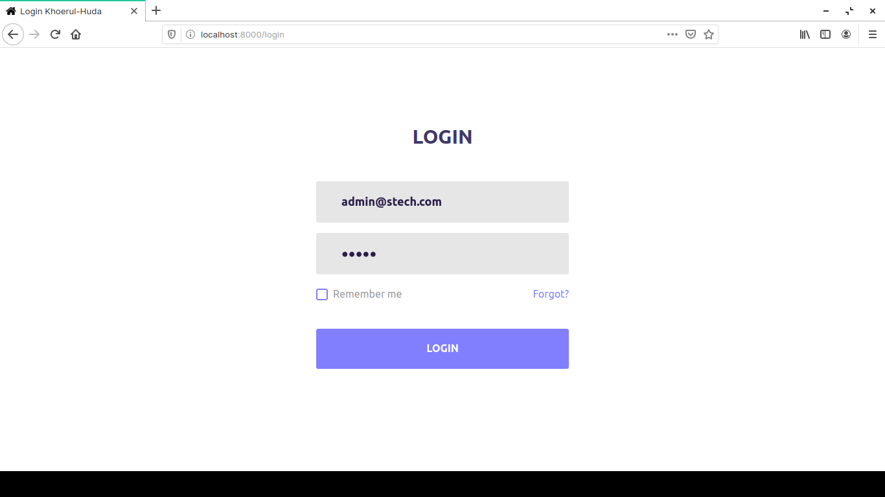
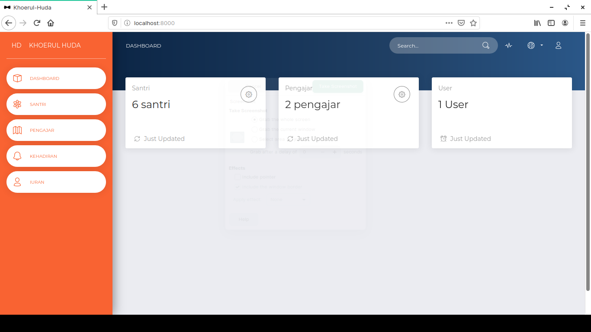

# m-ponpes

#### Installation Steps

1. Clone the repo : `git clone https://github.com/ibnusyawall/m-ponpes.git`
2. `$ cd m-ponpes`
3. `$ composer install`
4. `$ cp .env.example .env`
5. `$ php artisan key:generate`
6.  Setup config mysql or etc in .env files
7. `$ php artisan migrate`
8. `$ php artisan db:seed`
9. `$ php artisan serve`
10. Default Login : email: admin@stech.com | password : admin

## Screenshots

